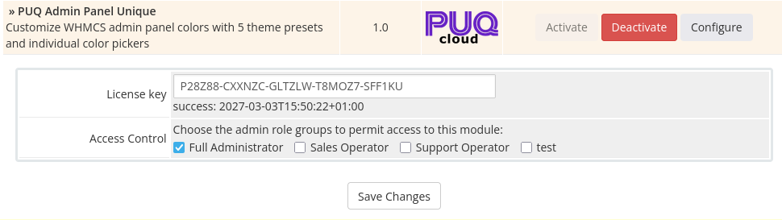

# Installation and Update

### Admin Panel Unique addon **[WHMCS](https://puqcloud.com/link.php?id=77)**
##### [Order now](https://puqcloud.com/store/whmcs-addon-modules) | [Documentation](https://doc.puq.info/books/puq-admin-panel-unique) | [FAQ](https://community.puqcloud.com/)

## System Requirements

| Requirement | Minimum |
|-------------|---------|
| **WHMCS** | 8.x, 9.x |
| **PHP** | 8.1, 8.2+ |
| **ionCube Loader** | v13 or newer (v14, v15) |

---

## Download

The module can be ordered and downloaded from PUQ Cloud:

- **Order / Download:** [https://puqcloud.com/store/whmcs-addon-modules](https://puqcloud.com/store/whmcs-addon-modules)
- **Documentation:** [https://doc.puq.info/books/puq-admin-panel-unique](https://doc.puq.info/books/puq-admin-panel-unique)
- **FAQ / Community:** [https://community.puqcloud.com/](https://community.puqcloud.com/)
- **Direct download links:**

PHP 8.1:

```bash
wget https://download.puqcloud.com/WHMCS/addons/PUQ_WHMCS-Admin-Panel-Unique/php81/puq_admin_panel_unique-latest.zip
```

PHP 8.2+:

```bash
wget https://download.puqcloud.com/WHMCS/addons/PUQ_WHMCS-Admin-Panel-Unique/php82/puq_admin_panel_unique-latest.zip
```

> All versions are available at: [https://download.puqcloud.com/WHMCS/addons/PUQ_WHMCS-Admin-Panel-Unique/](https://download.puqcloud.com/WHMCS/addons/PUQ_WHMCS-Admin-Panel-Unique/)

After downloading, extract the archive:

```bash
unzip puq_admin_panel_unique-latest.zip
```

---

## Installation

### Step 1: Upload Files

Extract the module archive and upload the `puq_admin_panel_unique` directory to the WHMCS addons directory:

```text
/your-whmcs/modules/addons/puq_admin_panel_unique/
```

Directory structure after upload:

```text
modules/addons/puq_admin_panel_unique/
    puq_admin_panel_unique.php
    hooks.php
    whmcs.json
    version
    logo.png
    lib/
        AdminPanelUniqueCore.php
    lang/
        english.php
        ...
    templates/
        ...
```

### Step 2: Activate the Module

1. Log in to the WHMCS admin panel.
2. Go to **Setup** > **Addon Modules**.
3. Find **PUQ Admin Panel Unique** in the list.
4. Click **Activate**.

During activation, the module creates (if missing):
- `mod_puq_admin_panel_unique_config` — module configuration storage
- `puq_license` — license verification cache table

### Step 3: Configure Access and License Key

1. Click **Configure** next to the module.
2. Enter your license key in the **License key** field.
3. Select admin role groups that should have access to the module.
4. Click **Save Changes**.

The license verification status appears under the license key field in module settings.


*01-addon-config-license.png*

### Step 4: Open the Module

Go to **Addons** > **PUQ Admin Panel Unique**.

You will see:
- **Dashboard** page (module overview, active preset and current colors)
- **Configuration** page (enable/disable, dark mode, presets, manual colors, live preview)

---

## Update

### Step 1: Backup

Before updating, back up:
- Your WHMCS database
- Module files in `modules/addons/puq_admin_panel_unique/`
- Module tables: `mod_puq_admin_panel_unique_config`, `puq_license`

### Step 2: Upload New Files

Extract the new version and overwrite all files in:

```text
/your-whmcs/modules/addons/puq_admin_panel_unique/
```

### Step 3: Verify

1. Log in to WHMCS admin panel.
2. Open **Addons** > **PUQ Admin Panel Unique**.
3. Check the module version in the top-right of the module navigation bar (for example: `v1.0`).
4. Open **Configuration** and confirm your saved settings are still present.

> Re-activation is not required after update. Overwriting files is enough.

---

## Deactivation

1. Go to **Setup** > **Addon Modules**.
2. Click **Deactivate** next to **PUQ Admin Panel Unique**.
3. Confirm deactivation.

> Deactivation does not remove module configuration data. The table `mod_puq_admin_panel_unique_config` is preserved for future re-activation.

---

## License

The module requires an active license for full functionality.

### How License Verification Works

- License key is stored in addon module settings.
- Online verification is performed against `https://license.puqcloud.com/api/v1/licenses_verification`.
- Verification result is cached in `puq_license`.
- Cache validity window is 5 days (module setting `days = 5`).
- If cached verification is valid for the current period, the module can continue working without an immediate online request.

### Without an Active License

- **Dashboard** remains accessible.
- **Configuration** page is locked and shows a license-required screen.
- A license warning appears in module pages and on WHMCS admin homepage.

### After Activating a License

1. Open **Setup** > **Addon Modules** > **PUQ Admin Panel Unique** > **Configure**.
2. Enter the license key and save.
3. Re-open the module page; the warning disappears and full functionality is available.

### Purchase a License

**[https://puqcloud.com/store/whmcs-addon-modules](https://puqcloud.com/store/whmcs-addon-modules)**

For license-related questions:

**[https://puqcloud.com/submitticket.php?step=2&deptid=1](https://puqcloud.com/submitticket.php?step=2&deptid=1)**
