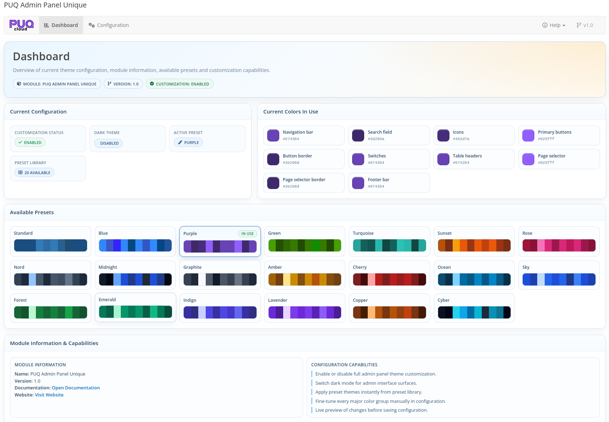

# Dashboard

### Admin Panel Unique addon **[WHMCS](https://puqcloud.com/link.php?id=77)**
##### [Order now](https://puqcloud.com/store/whmcs-addon-modules) | [Download](https://download.puqcloud.com/WHMCS/addons/PUQ_WHMCS_Admin_Panel_Unique/) | [FAQ](https://community.puqcloud.com/)

The Dashboard is the home page of the module, available at: **Addons** > **PUQ Admin Panel Unique** > **Dashboard**

It provides a quick overview of the current admin panel theme state: module version, customization status, dark mode state, active preset, current colors in use, and available preset library.

*02-dashboard.png*

---

## Current Configuration

The status card shows the current module state:

| Metric | Description |
|--------|-------------|
| **Customization Status** | Shows whether global styling overrides are enabled or disabled |
| **Dark Theme** | Shows whether dark mode surfaces are enabled |
| **Active Preset** | Displays the currently matched preset name, or **Custom Theme** if colors were manually adjusted |
| **Preset Library** | Total number of built-in presets available in the module |

---

## Current Colors In Use

The dashboard displays all active color groups with swatches and HEX values:

- Navigation bar
- Search field
- Icons
- Primary buttons
- Button border
- Switches
- Table headers
- Page selector
- Page selector border
- Footer bar

This block helps quickly audit the exact color palette currently applied in WHMCS admin.

---

## Available Presets

The preset library section lists all built-in themes and highlights the currently active one with an **In Use** marker.

The dashboard is read-only: to apply another preset or change colors, open the **Configuration** page.

---

## Module Information & Capabilities

The final section contains:

- Module name and current version
- Quick links to documentation and website
- A short capability summary (enable/disable customization, dark mode, presets, manual color controls, live preview)

This gives admins a compact operational summary without opening additional pages.
