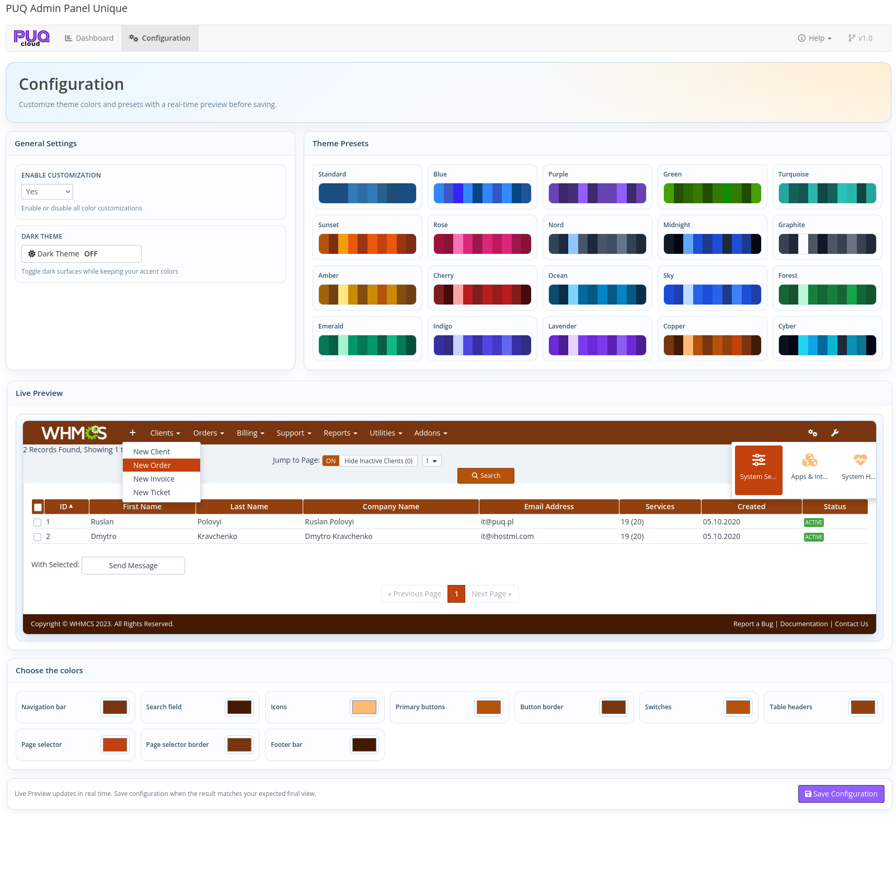
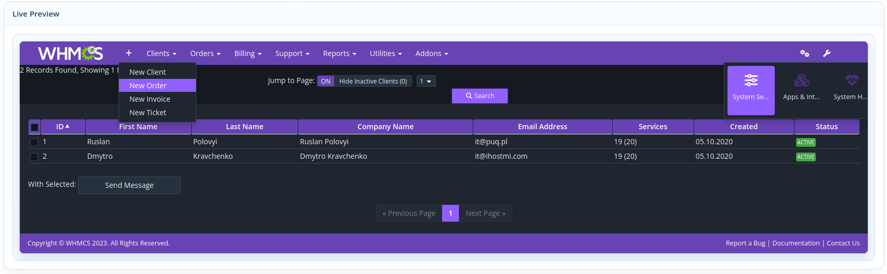

# Configuration Overview

### Admin Panel Unique addon **[WHMCS](https://puqcloud.com/link.php?id=77)**
##### [Order now](https://puqcloud.com/store/whmcs-addon-modules) | [Download](https://download.puqcloud.com/WHMCS/addons/PUQ_WHMCS-Admin-Panel-Unique/) | [FAQ](https://community.puqcloud.com/)

The Configuration page is available at: **Addons** > **PUQ Admin Panel Unique** > **Configuration**

This page is the main workspace for setting up the admin panel theme: enable/disable customization, dark mode, preset selection, manual color tuning, and save.

*03-configuration.png*

---

## Configuration Flow

Recommended workflow:

1. Enable customization.
2. Choose a preset as a base theme.
3. Fine-tune individual colors if needed.
4. Check the result in Live Preview.
5. Save configuration.

> Changes are not applied to WHMCS globally until you click **Save Configuration**.

---

## General Settings

### Enable customization

- **Yes**: module CSS is injected into WHMCS admin area and all selected colors are applied.
- **No**: custom styles are disabled and WHMCS default styling remains active.

When disabled, preset and color controls become inactive in the configuration form.

### Dark Theme

- Toggles dark surfaces for admin interface blocks while keeping your accent colors.
- Works together with your selected preset or manual colors.
- State is shown as ON/OFF in the toggle button and reflected in live preview immediately.

---

## Theme Presets

The module includes 20 built-in presets.  
Clicking a preset instantly fills all color fields in the form:

- Navigation bar
- Search field
- Icons
- Primary buttons
- Button border
- Switches
- Table headers
- Page selector
- Page selector border
- Footer bar

After selecting a preset, you can still manually adjust any color before saving.

---

## Manual Color Controls

The **Choose the colors** section provides direct per-element color editing via native color pickers.

| Color Field | Affects |
|-------------|---------|
| **Navigation bar** | Left navigation background |
| **Search field** | Top search input and button background |
| **Icons** | Icons in navigation dropdown menus |
| **Primary buttons** | `.btn-primary` elements |
| **Button border** | Borders for primary buttons |
| **Switches** | Bootstrap switch handles |
| **Table headers** | Datatable and themed table headers |
| **Page selector** | Active pagination and selector backgrounds |
| **Page selector border** | Borders for active pagination/selectors |
| **Footer bar** | Admin footer bar background |

---

## Live Preview

Live Preview shows how the admin UI will look with the current form values before saving.

*04-live-preview.png*

How it works:

- Any change in a color picker updates preview styles instantly.
- Preset click updates preview instantly.
- Dark mode toggle updates preview instantly.
- If customization is set to **No**, preview resets to default (non-customized) appearance.
- Checkbox/radio, table, pagination, navigation, search, and button elements are rendered in preview with current settings.

This allows safe visual tuning without affecting the production admin interface until save.

---

## Save, Validation, and Security

When you click **Save Configuration**, the module:

1. Validates CSRF token.
2. Normalizes boolean fields (`enabled`, `dark_mode`) to `yes`/`no`.
3. Validates color fields as HEX values.
4. Saves values to `mod_puq_admin_panel_unique_config`.
5. Redirects back to Configuration page (PRG flow) and shows success/error message.

---

## License Note

Configuration page requires a valid license.

- If the license is invalid, Configuration is locked with a License Required screen.
- Dashboard remains accessible in read-only mode.
